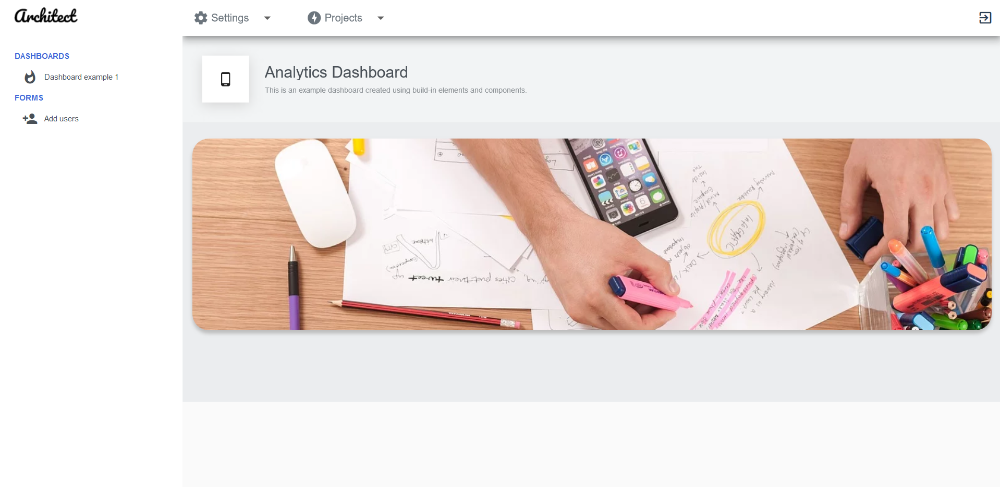

<h1>Architect Theme for Flutter</h1>
Architect Theme is a free semi-responsive admin template specifically built for Flutter Web Apps. 

The template has an attractive and elegant design. The template is well crafted, with all the components neatly and carefully designed and arranged within the template.

It is an excellent fit to build admin panels,  project management systems, or any App Administration App

This template is specifically designed for Flutter Web, not suited for mobile devices(except tablets on landscape mode). The reason for that is because there's almost no documentation for Flutter Web, and even worst packages are being labeled as "Web" but actually make your web apps crash and burn. This template will be unusuable in mobile devices, and that is on purpose.

